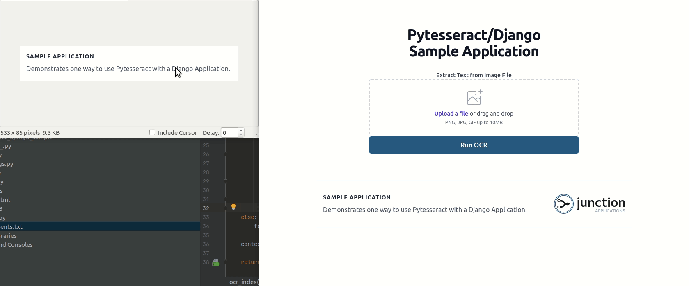

# PyTesseract/Django Sample
Prompted from this [Stack Overflow question](https://stackoverflow.com/questions/71864071/use-pytesseract-with-django) 
this little sample was thrown together.

Drag and drop a file with text, and run the pytesseract image_to_string method to obtain the text from the image.

## Optimizations
It would be recommended to review how to preprocess images for best results. [This article covers](https://nanonets.com/blog/ocr-with-tesseract/) how
to do some of that.